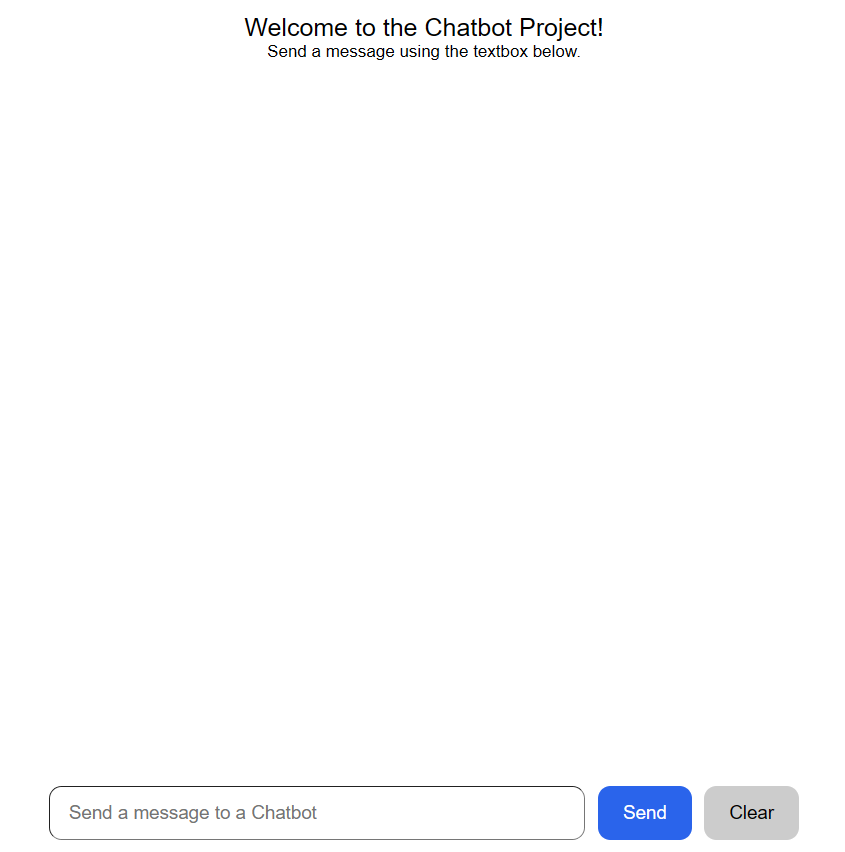
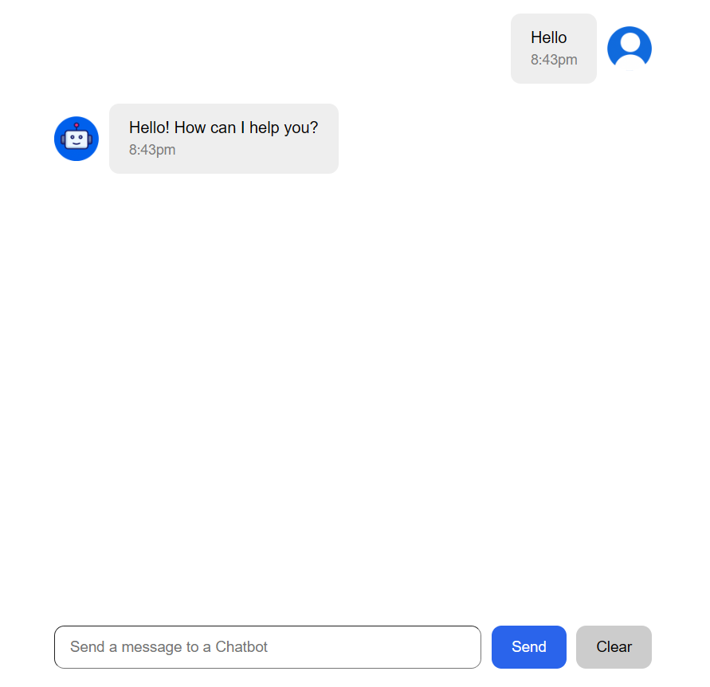

# Mini Chatbot Project
A simple, interactive chatbot web application built with React, HTML, and CSS. This chatbot is capable of responding in real time to user input with basic functionality such as:

- Providing today’s date  
- Telling the current day of the week  
- Rolling a virtual dice

## Screenshot
Below are the screenshots of the Mini Chatbot Project: <br />
What the chatbot looks like when you first open the app and when the chatbot responding after a user types a message.<br />
<br />


## [Live Demo Link](https://mini-chatbot-project.vercel.app/) 🚀

[](https://mini-chatbot-project.vercel.app/)

## Features

- Real-time chat interaction
- Recognizes specific commands:
  - `What is today's date?`
  - `What day is it today?`
  - `Roll a dice`
- Clean and responsive user interface

## Tech Stack

- **Frontend**: React JS  
- **Styling**: HTML, CSS

## Installation

To run this project locally:

```bash
git clone https://github.com/ivanajeo/mini-chatbot-project.git
cd chatbot-project
npm install
npm start
```
Then open your browser and go to: `http://localhost:3000`

## Usage
Try typing messages like:
- `What is today's date?`
- `What day is it today?`
- `Roll a dice`

The chatbot will respond appropriately based on your input.
